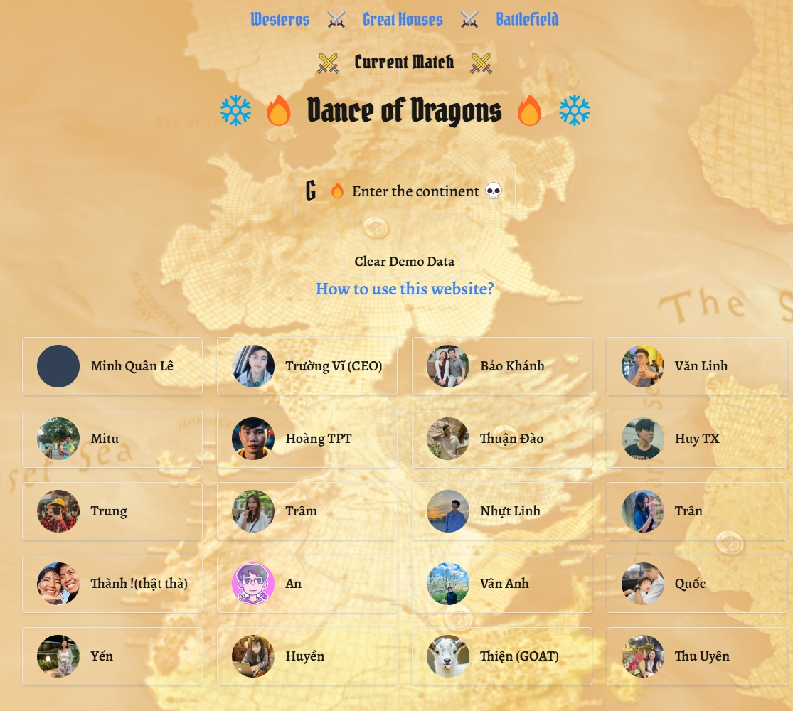
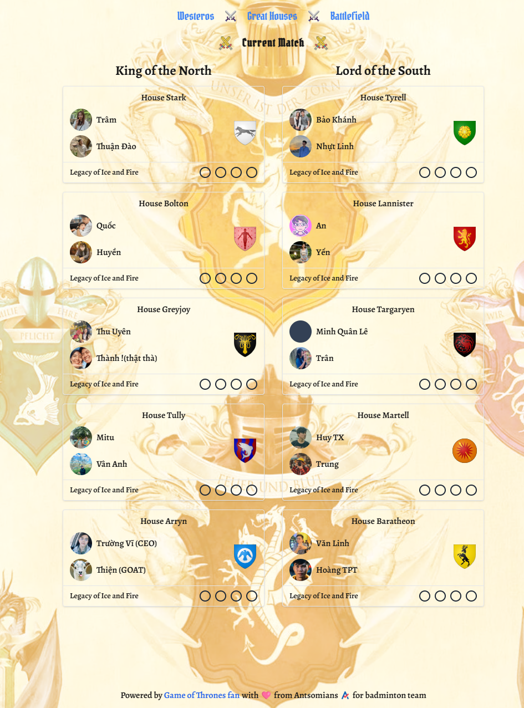
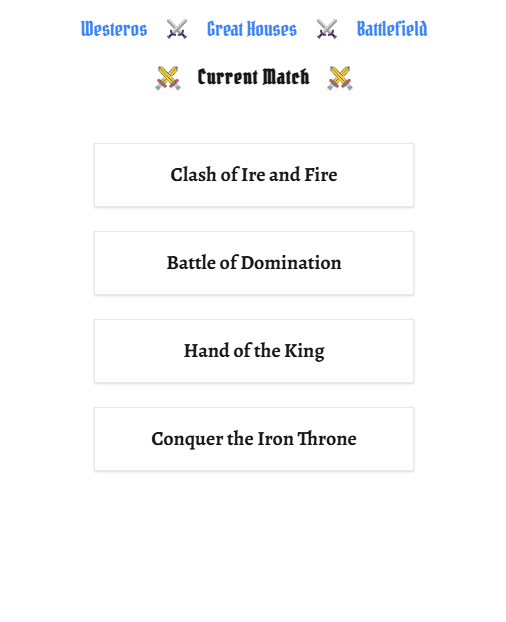
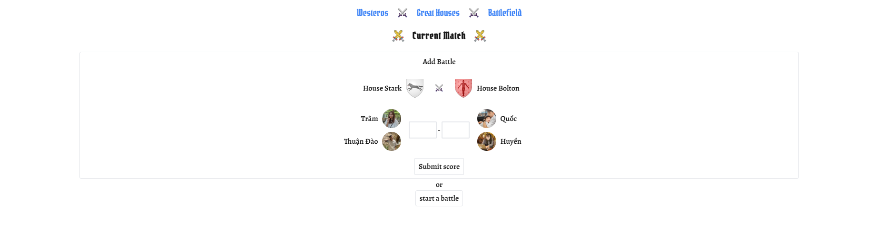
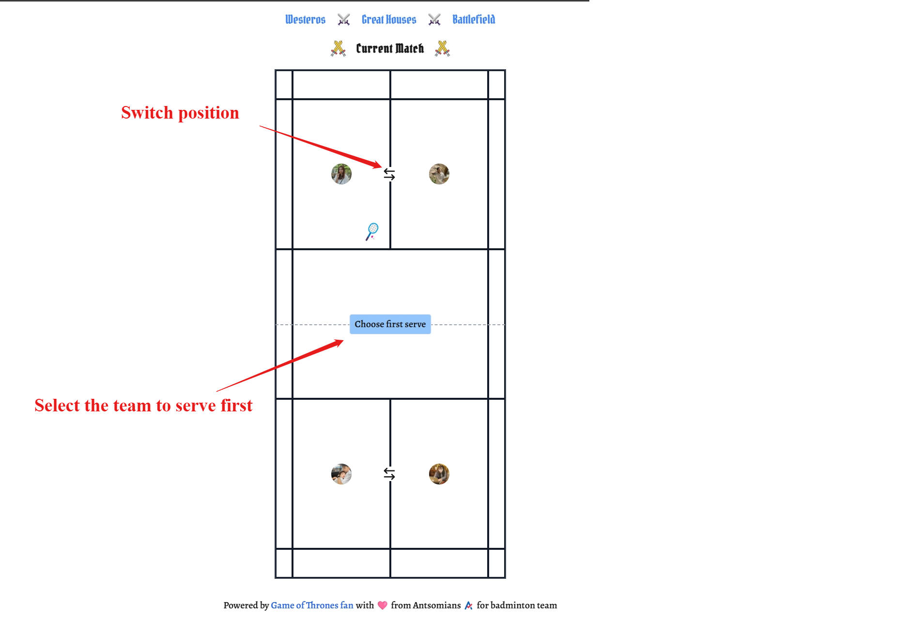
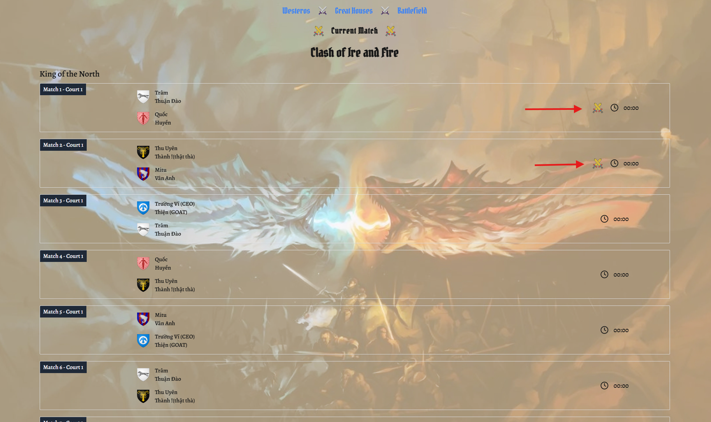

# Tournament documentation

### Link: [tournament.minhquanle.com](https://tournament.minhquanle.com)

### Archive version: [archive.tournament.minhquanle.com](https://archive.tournament.minhquanle.com)

### Note 1: the features and styles in this project are just basic and sufficient for use

### Note 2: The permission to edit results is intended for admin/moderator users. However, for convenience, this feature is temporarily available to all users who log in with Google

---

## Home Page (Westeros)

### Header menu explain:

> ### Westeros: The home page displaying all players participating in the tournament
>
> ### Great Houses: teams and result of the qualifications round
>
> ### Battlefield: Manage and display all match results, orders, and more

> ### Current Match: Real-time match scores controlled by moderators (admin or authorized users)

> ### Enter the continent: log in with Google

> ### I'm terrified, take me home: log out

> ### Clear demo data: Refresh the data if it has been modified by you or other users

---

## Teams Page (Great Houses)

The teams are named after the Great Houses in Game of Thrones.

**"Legacy of Ice and Fire"** displays the results of the qualification round. Each team will compete against four other teams within its group. The two teams with the highest rankings will advance to the next round.

---

## Match Center (Battlefield)

### Match title explain:

> ### Clash of Ire and Fire: Qualification round

> ### Battle of Domination: Semifinals (matches will be added after the 20 qualification matches are completed)

> ### Hand of the King: Bronze-medal round (matches will be added after the semifinals are completed)

> ### Conquer the Iron Throne: Final round to determine the champion

---

## Match Detail

You can input the final results or start a real-time match (if you are a referee for that match)

> ### Click "start a battle"

### Video demo

<!-- <video controls src="https://www.youtube.com/watch?v=tpVWyVcIOF0" title="Title"></video> -->

> ### Now start another match

### The current matches have icon to notice (only 2 match can happen at the same time)

> ### Click on Current Match at the top of the page to view the scores of these matches in real-time

> ### Admins can embed the ID of a YouTube video, allowing guests to watch the video and follow the scores in real-time

### Click to watch demo

<!-- <video controls src="assets/videos/realtime-tracking.mp4" title="Title"></video> -->
